## RISCV Instruction Latency Tests

This code measures the latency of various RISV instructions from the Base ISA and from the M, F, and D extensions on the Rocket chip (https://github.com/freechipsproject/rocket-chip) using a Verilator-based simulation.

### Prerequisites

  - Go (with the `gitlab.com/ashay/bagpipe` package)
  - R (with `ggplot` and `reshape2` packages)
  - Scripts assume `riscv64-unknown-elf-gcc` is in `PATH`, and that the Rocket chip is built in `${HOME}/src/rocket-chip/emulator`.

### How to Gather Data and Plot Results

    cd src
    
    # Specify targets to build
    go run ../scripts/driver.go build-int build-sp build-dp
    
    # Run tests for a specific instructions
    go run ../scripts/driver.go run-fdiv.s
    go run ../scripts/driver.go run-add
    go run ../scripts/driver.go run-div
    
    # Plot data (for all instructions)
    cd ../scripts
    R --no-save < plot.R

### Note about Debug Interrupts

If you plan to tweak the loop count in `src/*-driver.c`, note that running the test for too long may cause the (occassional) debug interrupts from the simulation to perturb the results.  In particular, if you see a wide variation in the instruction count (despite only changing the operand values), then the debug interrupts are suspect.  See https://github.com/freechipsproject/rocket-chip/issues/1495 for details and how to know whether the debug interrupt occured.

## Results

### Interesting Cases

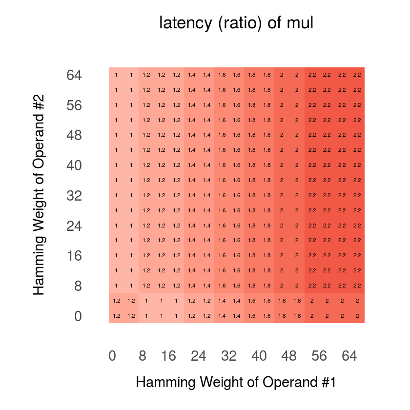
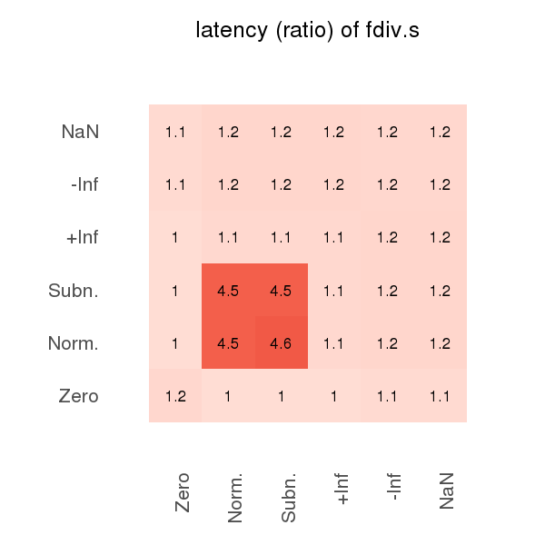

### Not-So-Interesting Cases
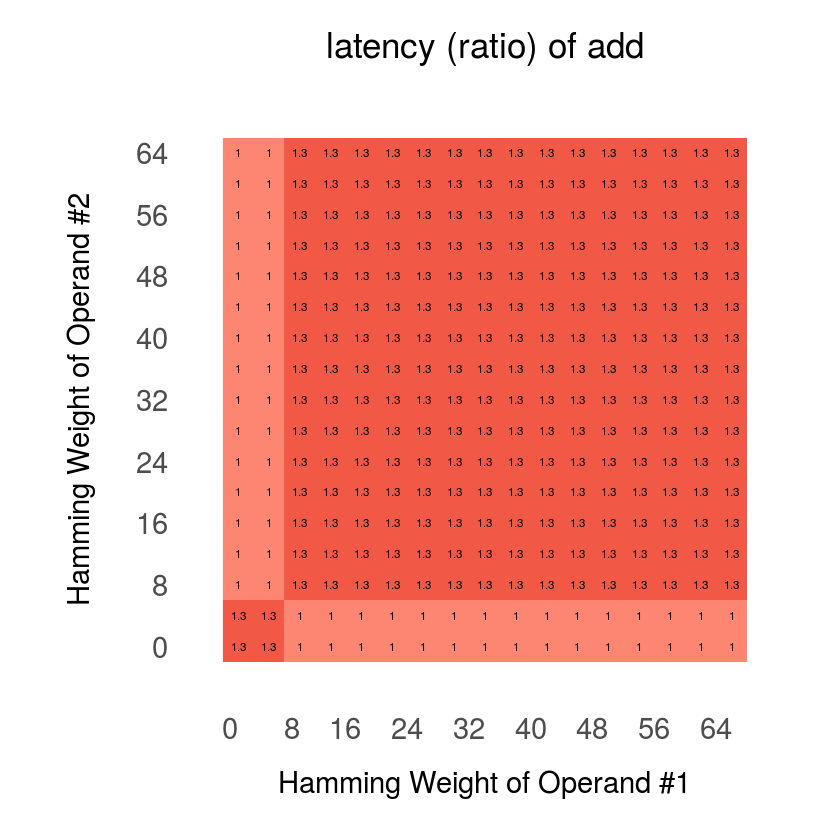

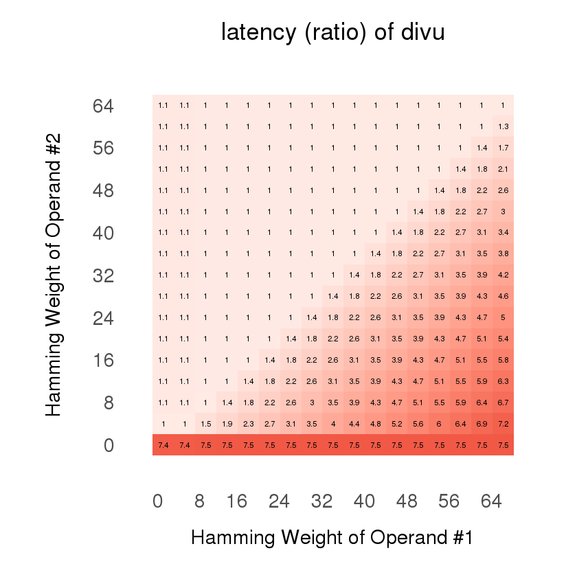
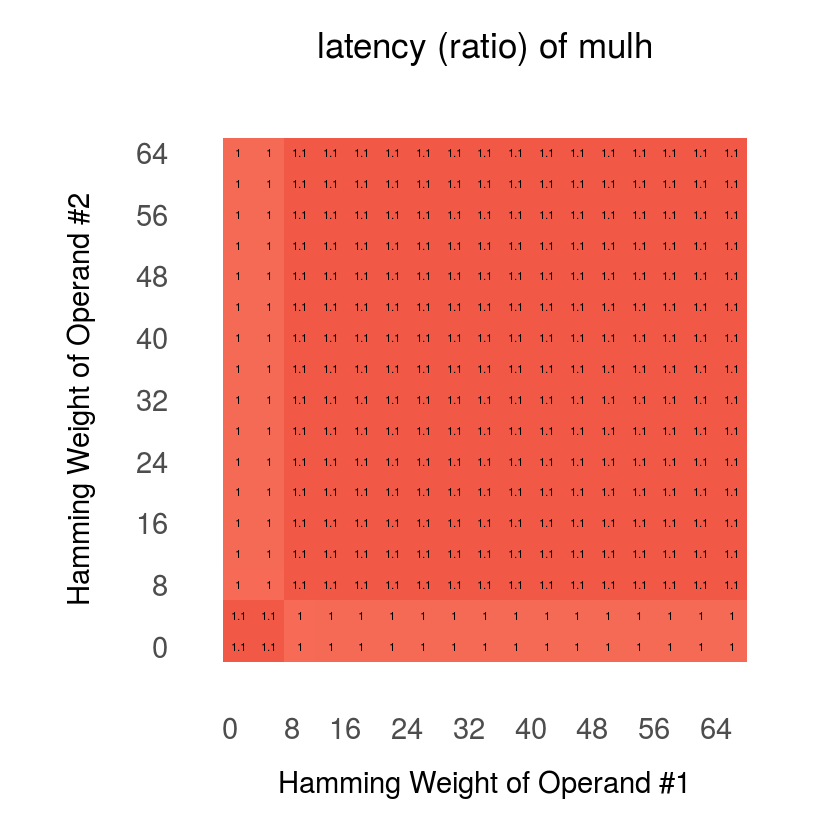
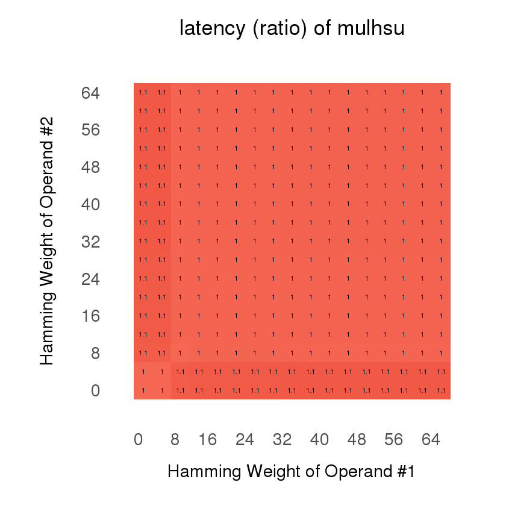

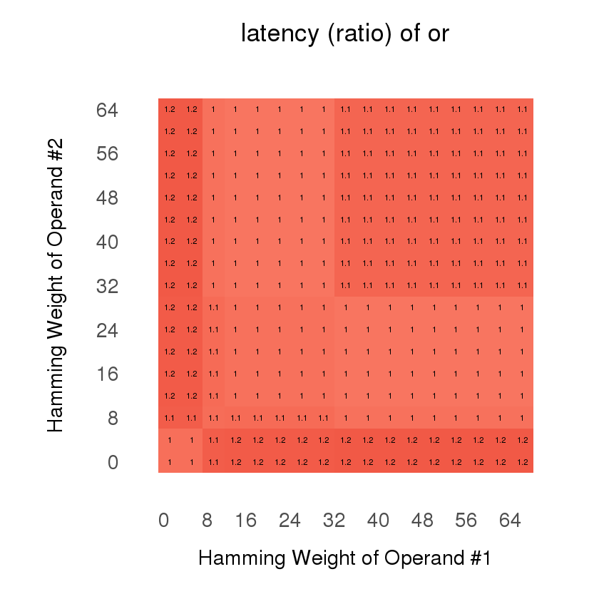

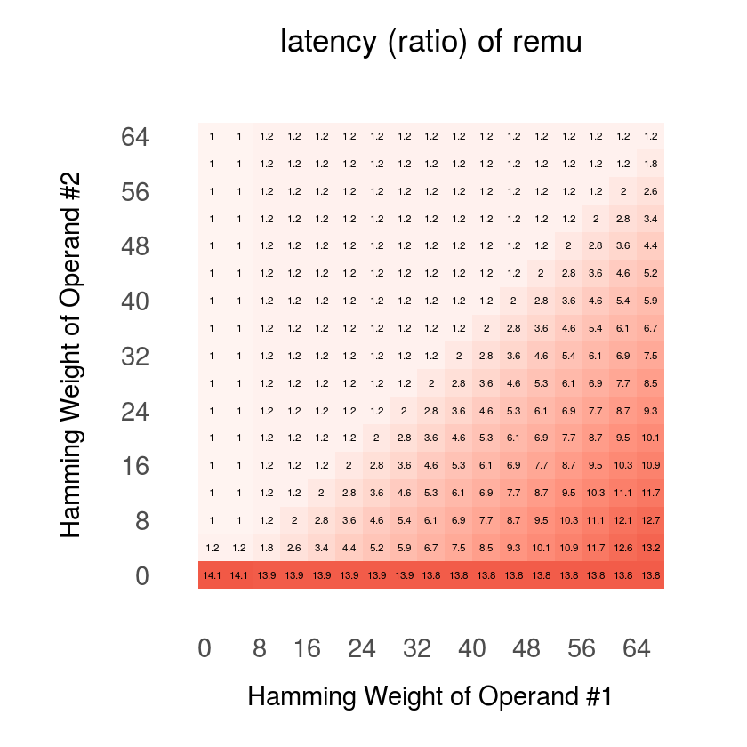

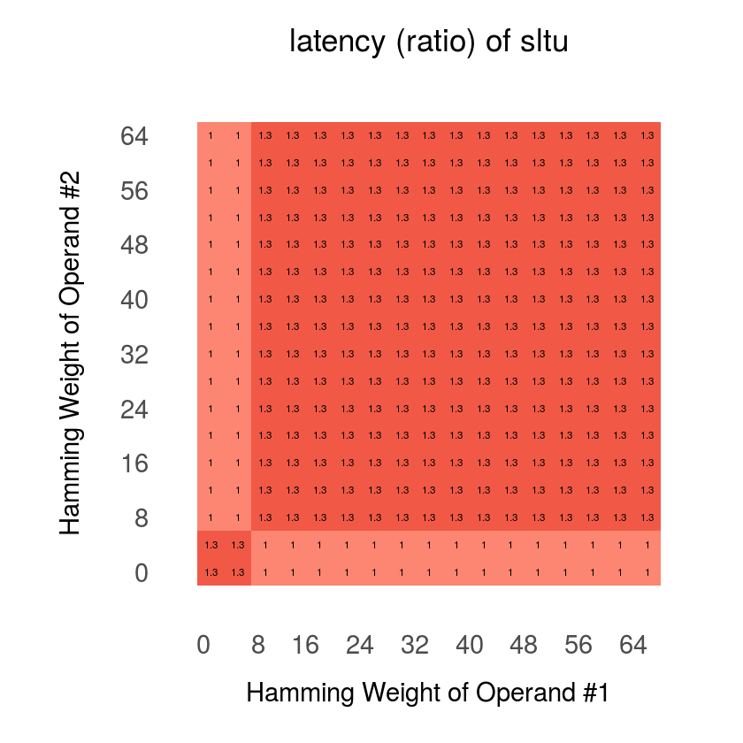
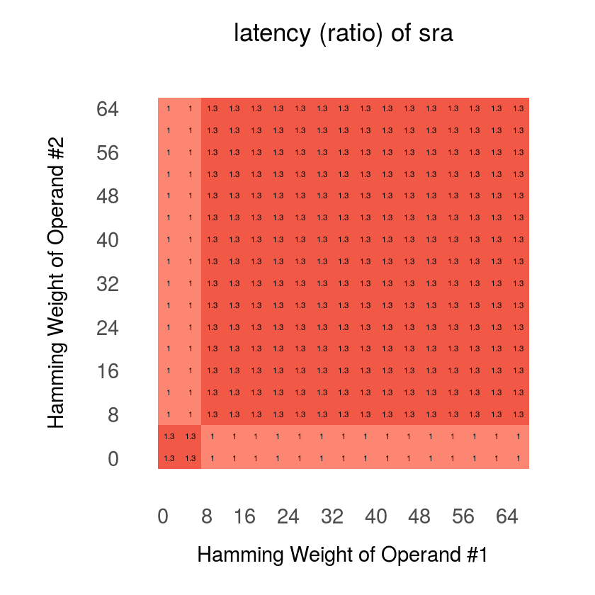

                                                                                                                        
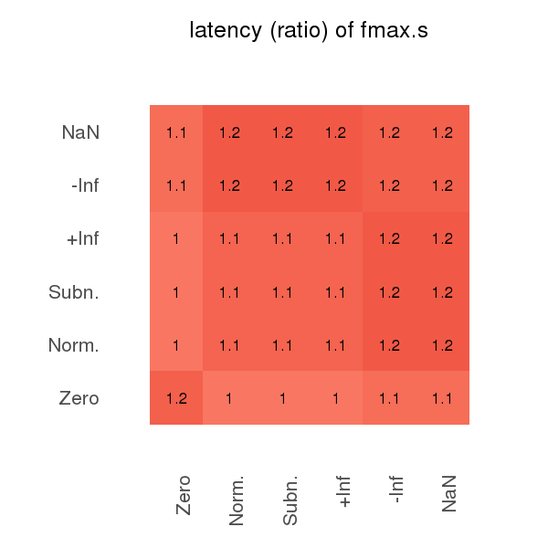
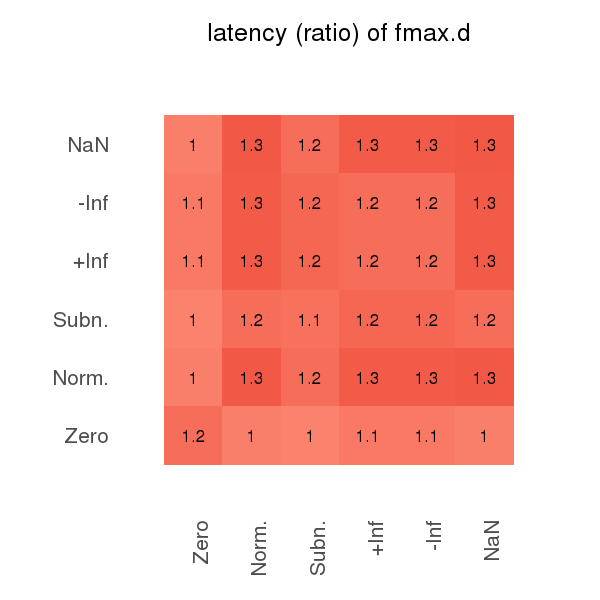

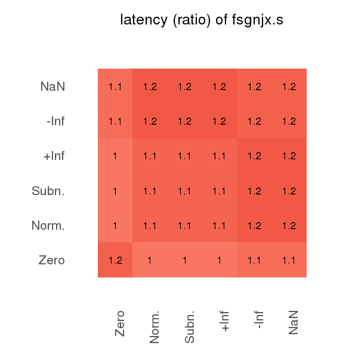
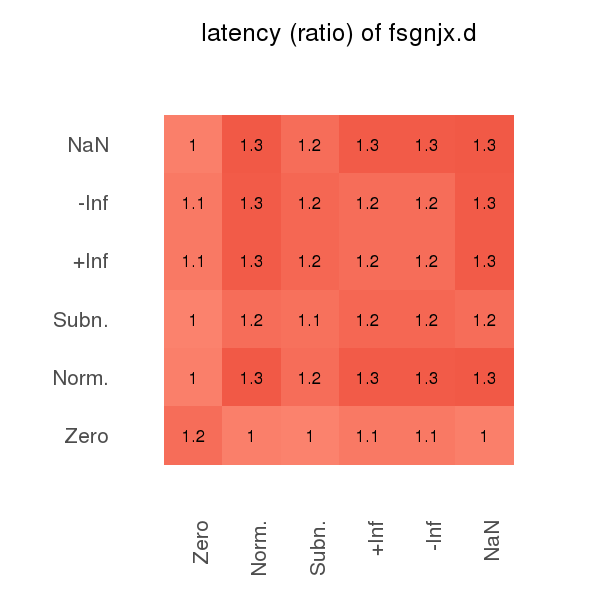
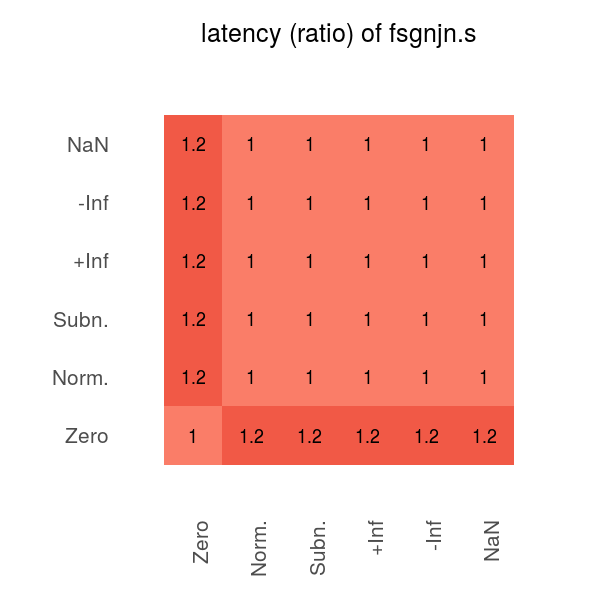

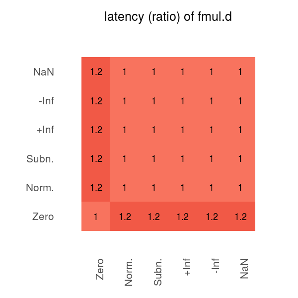

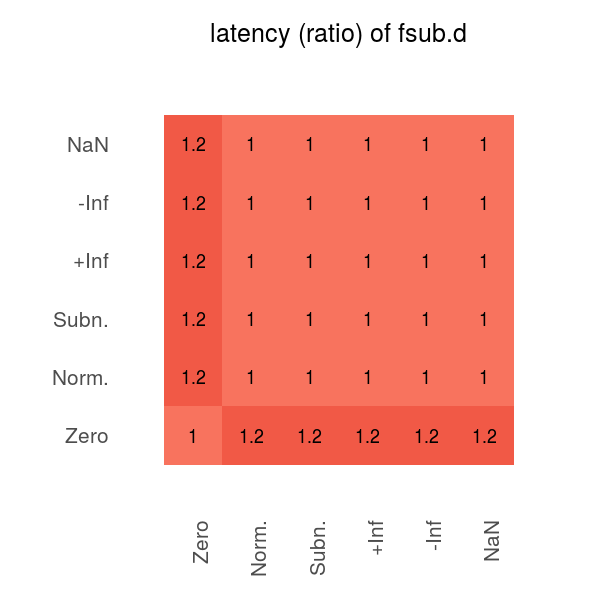

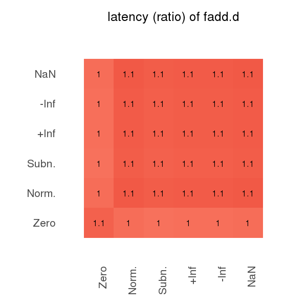
